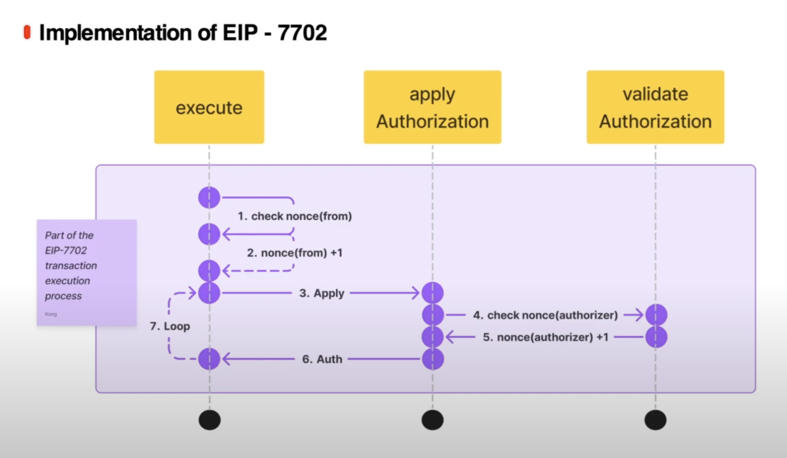

# 你的名字

1. 自我介绍：我是 Alex，一名 Solidity 合約開發者。
2. 你认为你会完成本次残酷学习吗？ 會
3. 你的联系方式（推荐 Telegram）：無

## Notes

<!-- Content_START -->

### 2025.05.14

本日學習內容：

-   https://www.nethermind.io/blog/eip-7702-attack-surfaces-what-developers-should-know

筆記內容

> # Introduction
>
> Ethereum 有兩種帳戶類型：
>
> -   Externally Owned Accounts (EOAs)：由私鑰控制，沒有鏈上程式碼（如 Metamask）。
> -   Smart Contract Accounts：具備鏈上邏輯，能執行複雜操作。
>
> EIP-7702 的目標是讓 EOAs 可以擁有「程式碼」，將其功能接近 Smart Contract Accounts。
>
> 新功能範例： 批次處理操作（batching）、原生多重簽章（multisig）
> 風險警告：若實作不當或缺乏審計，將導致新的安全漏洞。
>
> # What is EIP-7702?
>
> -   EIP-7702 引入一種新交易類型(0x04 type transaction)，讓帳戶可以設定並指派程式碼給自己。
> -   實作方式：
>     -   非直接將合約碼儲存在帳戶中。
>     -   使用一個特殊前綴 0xef0100 加上位址形成的指標，指向鏈上的合約地址（delegation designator）。
>     -   錢包僅「指向」一個智慧合約，由該合約邏輯決定帳戶行為。
> -   新交易型別的關鍵要素：
>     -   Authorization List（授權清單）：
>         -   結構：[chain_id, address, nonce, y_parity, r, s]
>         -   包含鏈 ID、智慧合約地址、nonce 與簽名資料。
>     -   Delegation Mechanism（委託機制）：
>         -   EOA 可藉由委託方式執行高階功能，例如：
>             -   在一筆交易中執行多個操作（batching）
>             -   替新用戶代付 gas（gas sponsorship）
> -   與 Smart Contract Account 的差異：
>     -   即使行為由智慧合約控制，EOA 的私鑰仍有完全控制權。
>     -   安全風險：私鑰一旦被竊取，攻擊者能完全掌控帳戶，即便有委託合約。
>
> # Comparison with EIP-4337
>
> -   EIP-7702：
>     -   允許 EOA 使用鏈上程式碼指標（code pointer） 來委託其行為。
>     -   設計較輕量（leaner integration）。
>     -   更適合特定用例的直接整合。
> -   EIP-4337：
>     -   採用 更全面的 Account Abstraction 架構。
>     -   使用 off-chain bundler 和 專用的 EntryPoint 智慧合約。
>     -   提供更完整的擴充性與功能。
>
> 兩者關係都是在提升帳戶功能與抽象能力。EIP‑7702 與 EIP‑4337 並不互斥，可並存。各自適用於不同的需求與場景，合力推進 Ethereum 帳戶模型的演進。

### 2025.05.15

本日學習內容：

-   https://www.nethermind.io/blog/eip-7702-attack-surfaces-what-developers-should-know
-   [A Deep dive into EIP-7702 with best practices](https://www.youtube.com/watch?v=uZTeYfYM6fM)

> # Security Risks and Vulnerabilities
>
> 開發委託合約（delegate contract）本身並不直覺，以下是開發者需要知道關於 EIP-7702 的特性:
>
> -   多個 EOA 可以同時指向同一個委託合約（delegate contract）
> -   用戶可以重新委託（redelegate），從一個委託合約切換到另一個。
> -   EOA 擁有者可以將委託設為 address(0) 來清除程式碼，將帳戶恢復為「普通 EOA」。
>
> 以下是常見漏洞
>
> ## 1. Access Control
>
> ### 1.1 Lack of access control
>
> 若 delegate contract 缺乏存取控制（Access Control），任何人都能代表 EOA 執行任意邏輯，例如轉走資產。
>
> ```solidity
> //SPDX-License-Identifier: MIT
> pragma solidity 0.8.20;
>
> contract VulnerableContract {
>   function doSomething(bytes memory _data, address _to, uint _value) public payable {
>       (bool success, ) = \_to.call{value: \_value}(\_data);
>       require(success);
>   }
> }
> ```
>
> -   任何人都能調用 `doSomething`，執行任何目標合約的函式呼叫，包含轉走 EOA 下所有資產。
>
> ## 2. Initialization challenges
>
> ### 2.1 Constructors
>
> -   當 EOA 授權成為 delegate contract 時， EOA 並不會執行 delegate contract 中的 constructor，也是就說 EOA 無法靠 constructor 來進行參數初始化的動作。
>
> ```solidity
> //SPDX-License-Identifier: MIT
> pragma solidity 0.8.20;
>
> contract Random {
>     uint a;
>     constructor(uint _someNumber) {
>         a = _someNumber;
>     }
> }
>
> ```
>
> 當 Alice 將 EOA 委派變成 Random 合約時，合約在委派過程中並不會執行 constructor。如果 Alice 想初始化變數，應該採用初始化函式（initialize pattern），類似 proxy 合約的初始化邏輯。
>
> ### 2.2 Front running and (re)initialization
>
> 如果 delegate contract 中的 `initialize` 函式無適當存取控制，可能會被惡意第三者進行 Front run 攻擊。
>
> ## 3. Storage collisions
>
> ### 3.1 Persistent state across redelegations and upgrades
>
> 當用戶重新委託或是恢復成為普通的 EOA 時，在委託成 delegate contract 時，所使用到的 storage 並不會被清除，而這可能會讓用戶在不同 delegate contract 切換時出現 storage collision 的問題。

### 2025.05.16

本日學習內容：

-   [A Deep dive into EIP-7702 with best practices](https://www.youtube.com/watch?v=uZTeYfYM6fM)

> # EIP-7702 Transaction Process
>
> 
>
> -   交易執行會增加 nonce，授權也會增加 nonce 值。如果授權 delegate contract 時，該 EOA 的 nonce 會增加 1，如果授權授權也自己簽一筆 EIP-7702 格是交易帶上鏈，那們 EOA nonce 就會增加 2。
> -   在 EIP-7702 交易中，會引入一個欄位叫 Authorization List，該欄位為一個存放多個 Authorization Tuple（`[chain_id, address, nonce, y_parity, r, s]`） 的陣列:
>     -   如果 Authorization Tuple 驗證成功，就會更新授權者 EOA 上的代碼。
>     -   如果 Authorization Tuple 驗證失敗，則直接跳下一個 Authorization Tuple 執行。
>
> # Best Practice
>
> ## Privatekey
>
> -   將 EOA 委任給智能合約後，雖然能在合約邏輯上實現各種保護資產的安全機制，但是私鑰仍然保有 EOA 控制的最高權限。因此，私鑰的保護仍然是首要任務。
> -   Not Your Keys, Not your coins.
>
> ## Multi-chain Replay
>
> -   當將 EOA 進行委託時，可以透過簽名中的 chainId 指定授權僅適用於特定鏈。然而，若將 chainId 設為 0，則表示用戶同意該授權在所有鏈上皆可生效，實現跨鏈授權的效果。但需要特別注意的是，即使同一地址在不同鏈上看似一致，實際上的實作細節可能存在差異。因此，在允許多鏈共用同一份授權時，務必特別謹慎，以避免潛在的安全風險或行為不一致的問題。
>
> ## Storage Management
>
> EIP-7702 切換或撤銷委託只會清除 code region，並不會清除掉 EOA 下使用過的 storage。
>
> -   對用戶來說，因為當前並沒有標準的安全切換 delegate contract 流程，因此在切換新的 delegate contract 前，最好是能確保 delegate contract 本身的開發團隊信良好，並且不要在 EOA 下保留太多資金。
> -   對開發者來說，在開發過程中可以遵循 ERC-7201，盡可能減少 Storage Collision 帶來的風險。
> -   對錢包廠商來說，如果 ERC-7779 後續有通過提案的話，可遵循提案的標準流程在每次切換委託時，都先將使用過的 storage 清除掉。
>
> ## Account Conversion
>
> -   在 EIP-7702 之後，EOA 帳戶具有智能合約的功能，意味著過去對於 `tx.origin` 一定是來自單純的 EOA （即 code region 為空）這項假設將不再成立。
> -   因此過去用來判斷單純 EOA 假設的方式： `tx.origin == msg.sender` 的方式也將不再可靠。

### 2025.05.17

本日學習內容：

-   [EIP-7702: A Deep Dive into Smart EOAs with Implementation Examples](https://hackmd.io/@colinlyguo/SyAZWMmr1x)

> # Introduction
>
> EIP-7702 為一般 EOA 帶來了許多可能性，以下是一些有趣的功能：
>
> -   社交恢復（Social Recovery）
>     -   適合擔心私鑰遺失的用戶。
>     -   可透過信任人群或設定機制恢復控制權。
> -   交易批次處理（Transaction Batching）
>     -   簡化交易流程，例如合併 ERC-20 的 approve + transfer。
>     -   更高效的 Token 操作。
> -   交易贊助（Transaction Sponsorship）
>     -   支援第三方代付 gas，如 Sequencer 或 Wallet Server。
>     -   對沒有原生代幣的用戶更加友善。
> -   任意簽章機制（Arbitrary Signing Keys）
>     -   可支援多種鑰匙格式，如 WebAuthn、P256、BLS 等。
>     -   提供更多安全與創新空間。
> -   Session Keys 支援
>     -   可設定有效期與操作範圍的臨時密鑰。
>     -   強化安全性、減少釣魚攻擊風險。
>     -   適合 DApp 沙箱操作與訂閱模型。
>
> # 與 ERC-4337 的整合性
>
> -   EIP-7702 可與 ERC-4337 完美整合。
> -   Smart EOAs 可直接用作 UserOperation.sender 欄位。
> -   利於開發者使用現有基礎設施，推動新功能落地。
>
> # 安全性討論
>
> -   EIP-7702 雖然可透過社交恢復的方式來解決私鑰遺失的問題，但仍無法解決私鑰洩漏的問題，因為私鑰對 EOA 仍然具有最高權限的控制權
> -   目前社區有提案 [EIP-7851](https://eips.ethereum.org/EIPS/eip-7851) 希望能夠允許禁用/啟用私鑰對於委託狀態下 EOA 的控制權
> -   不過提案目前還尚未通過，目前建議的做法是用戶授權完 EOA 變成 delegate contract 後，就直接棄用私鑰不在任何地方保存備份，以降低私鑰外洩的可能性。

<!-- Content_END -->
