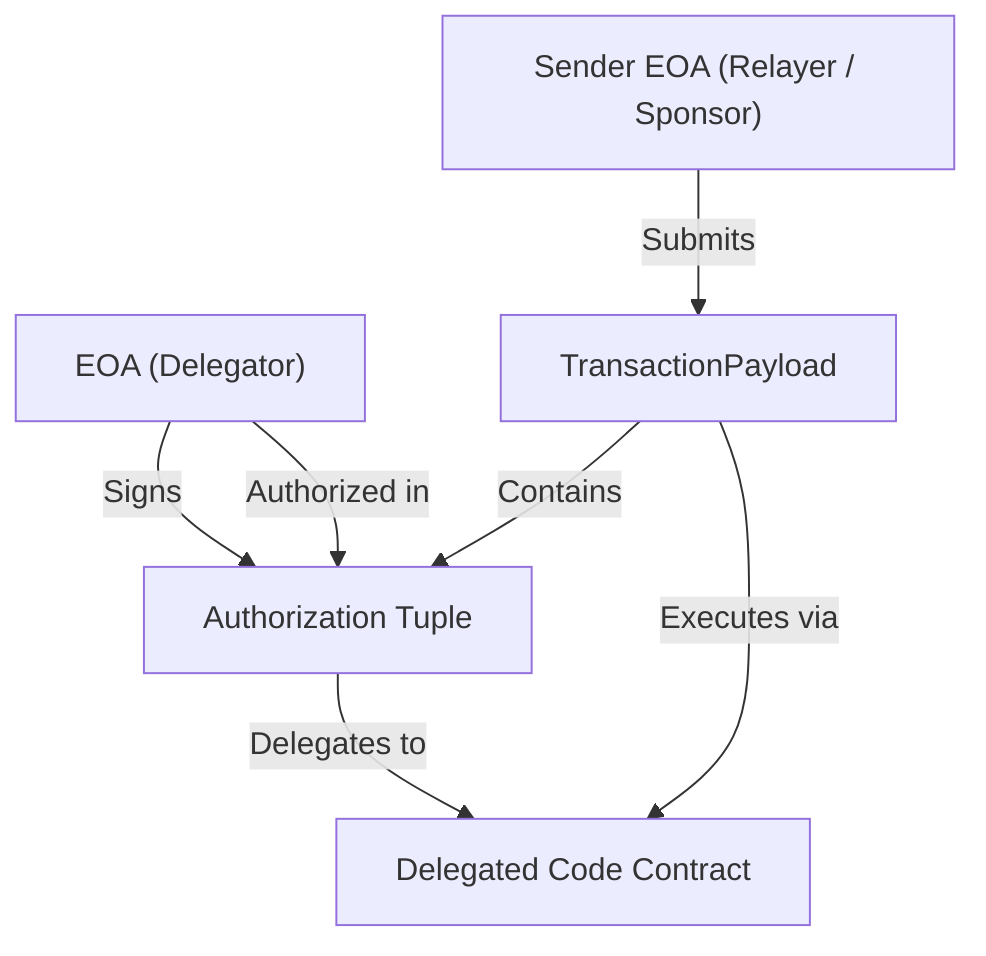
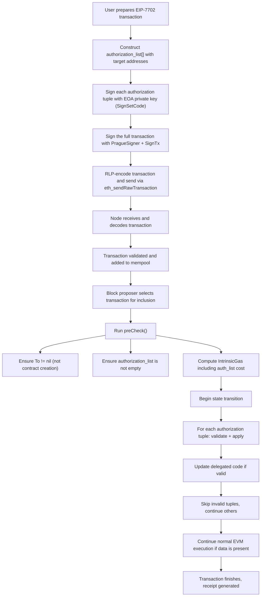

# fffuuuming
1. 自我介绍:
我目前為台灣大學資工碩一的學生，於大四時接觸到以太坊和智慧合約，對此相當有興趣並開始自學。碩班的研究主題也聚焦在smart contract, defi protocol 相關的 security issue，比較熟的主要有 price manipulation attack, collision in proxy contract 的 auto detection。
由於太晚認識到 DeFiHackLab這個社群，導致之前的殘酷共學沒參加到，但我也有自己把 WTF solidity 上的教學看過。這次看到有新的共學便決定要參加，在此也許願 Solidity 跟 CTF 的殘酷共學有機會能再開
2. 你认为你会完成本次残酷学习吗？
會的，我在今年ㄧ、二月時即有大概看過eip-7702並與eip-4337, eip-3074比較，相信這次能快速上手
3. 你的联系方式（推荐 Telegram）
https://t.me/fffuuuming
## Notes

<!-- Content_START -->

### 2025-05-14
#### Core idea of EIP-7702
- **What** : Account Abstraction, allow EOAs to have code, which enable EOAs for batch operations, implementing native multisig, or alternative signature schemes
- **How** : Introduces a new transaction type `SET_CODE_TX_TYPE (0x04)` that allows accounts to set and delegate code on themselves
    - **delegation designator** : a specific prefix, which is followed by an address and stored in the **account's code** instead of the full contract code
        - (```0xef0100``` || ```address```)
        -  Indicates where the actual smart contract code resides on-chain.
    - **authorization list** : ```[chain_id, address, nonce, y_parity, r, s]```
#### Some notes
- Multiple wallets can point to the same delegation designator contract at the same time.
- Can **redelegate** from one delegation designator contract to another, but be aware of **collision**
- The owner of the EOA can **clear the code by delegating to address(0)**. This will restore your EOA back to normal.
#### Security Risk & Vulnerabilities
1. Delegate contract lacks proper access controls
2. Initialization challenges
    - **Constructors** : The delegation transaction doesn’t include ```initcode```,  so the ```constructor``` of the delegation designator contract does not execute in the context of the EOA -> use **initialization pattern**
    - **Front running and (re)initialization**
        - ensure that the ```initialize``` function has proper access controls and cannot be re-initialized
        - delegate and call the ```initialize``` function in the same transaction, otherwise it may be frontran
3. Storage collisions
Delegating code does not clear existing storage
    ```solidity!
    //SPDX-License-Identifier: MIT
    pragma solidity 0.8.20;

    contract ContractA{
        bool thisIsABool = true;
    }

    contract ContractB{
        uint thisIsAUint;
    }
    ```
    - migrate from ```ContractA``` to ```ContractB```
    - Ignore accountting for the old storage data
    - Storage collision : ```uint``` in the second contract will be interpreted as a ```bool```

### 2025.05.15
#### Some important notations
- **Delegated code**: A smart contract implementation that an ```EOA``` points to and relies on to define its behavior
- **Delegator account**: The ```EOA``` that initiates the transaction and delegates control to the delegated code during execution, still a regular ```EOA``` with a private key, but temporarily acts like a smart contract by borrowing logic from delegated code.
- **Smart EOA**: Delegator account that has delegated to delegated code for that transaction -- behave like a smart contract

Example:
- A contract at address ```0xProxyImpl``` contains reusable wallet logic like batching transactions, verifying signatures, or auto-paying gas.
- Alices' wallet address ```0xAliceEOA``` wants to behave like a smart wallet for a specific transaction. It points to ```0xProxyImpl``` as its logic.
- In that transaction, ```0xAliceEOA``` acts like it has that logic built in, even though it’s just pointing to the logic stored elsewhere.
#### Core Component Structure
- **TransactionPayload**
    ```text
        TransactionPayload = rlp([
          chain_id,
          nonce,
          max_priority_fee_per_gas,
          max_fee_per_gas,
          gas_limit,
          destination_address,
          value,
          data,
          access_list,
          authorization_list   👈 new in 7702
        ])    
    ```
- **Authorization List**: List of ```authorization tuples```, i.e., signatures that prove the EOA allows this delegation.
    ```text!
    authorization_list = [
      [chain_id, address, nonce, y_parity, r, s],
      ...
    ]
    ```
    - ```chain_id```: For replay protection.
    - ```address```: The delegated code addresses
    - ```nonce```: For replay protection of the signature.
	-  ```y_parity, r, s```: ECDSA signature components, used to validate & recover ```EOA``` (signer)
-  **Transaction Receipt**: Same as before
    ```text!
    rlp([status, cumulative_transaction_gas_used, logs_bloom, logs])
    ```

#### Important features
- **Enforcing Non-Empty authorization_list**
The ```authorization_list``` must not be empty: each EIP-7702 transaction must include an explicit intention to authorize an implementation address.
- **Delegation Through authorization_list**
authorization tuple : ```[chain_id, address, nonce, y_parity, r, s]```
    - authorized address (delegated code address): ```address``` field in tuple
    - signer’s address: derived from payload (```chain_id, address, nonce```) & signature (```y_parity, r, s```)
        > Ethereum signatures can be used to recover the public address of the signer (```ecrecover()```)
    - Decoupling of the ```EOA address``` (signer) and the ```EIP-7702 transaction's address``` (delegated code address): allows **the authorization to be submitted on behalf of the original EOA by another EOA account**: 
    - Enable sponsored transaction
- **A New Case for Nonce Increment**
    - **tx.nonce**: the nonce of the **transaction sender**
    - **authorization.nonce**: the nonce used inside the **authorization tuple**, signed by the **delegator account**

    This will cause the following scenario:
    1. If the same EOA is signing both:
        - tx.nonce = current account nonce
        - authorization.nonce = account nonce + 1
    2. If there are multiple authorizations by the same EOA: Their nonces must **increment in sequence**.  
        > note: it may not happen in practical use cases, since mutiple authorizations by the same EOA will eventually exist only one valid authorization
- **Multi-Path Account Balance Changes**
From anywhere within a transaction, **the EOA’s delegated code can be called and executed via any contract call or extrnal call at any time**, and hence modify an EOA’s state (e.g. ```balance```) at any time<br>  
For example:
    - Bob create and sign an EIP-7702 transaction, but the delegated code can be called multiple times by other contracts during the execution of that one transaction  
        ```tex!
        SetCodeTx {
          from: Bob,
          to: ContractA,
          data: ContractA.triggerSomething()
          auth_list: [{ address: ContractX }]
        }
        ```
        1. Bob → ContractA.triggerSomething()
        2.	ContractA calls Bob (who is now running ContractX logic)
        3.	ContractX logic does something
        4.	ContractA calls Bob again
        5.	ContractX logic again ...  
    - Alice has a smart contract that assumes  
        ```solidity!
        require(user.balance >= 10 ether);
        ```
        And it does this check during some internal logic to maintain an invariant, but Bob (EOA with delegated code) then call this contract and call back into himself, run delegated logic that sends away all ETH from his own account mid-execution -> **the assumption that ```user.balance remains ≥ 10``` ether is no longer guaranteed**
    - EIP-7702>EIP-7702 wallet implementations cannot rely on locally maintained invariants and must query real account states
- **In-Protocol Revocation**: Set ```address``` field inside ```authorization tuple``` to be ```0x0000000000000000000000000000000000000000```
-  **Re-delegation**: Requires careful storage management to avoid collisions
    - [ERC-7201](https://eips.ethereum.org/EIPS/eip-7201):  roots storage layouts at unique slots
    - [ERC-7779](https://eips.ethereum.org/EIPS/eip-7779)
- **Classic EIP-1559 Fields**
    - Adopts the [EIP-1559](https://eips.ethereum.org/EIPS/eip-1559) gas fee model
    - Enforces a restriction that the ```destination``` , similar as EIP-4844 (```to``` in other transaction types) field cannot be empty
    - Can't carry blobs as [EIP-4844](https://eips.ethereum.org/EIPS/eip-4844)
- **No instruction prohibition**  
No storage instructions are banned like [EIP-7562](https://eips.ethereum.org/EIPS/eip-7562) since these instructions are very important for SC wallets.
#### 🛠 EIP-7702 Implementation in Geth
1. **Transaction Types**
    - A new transaction type represented by a specific ```TxType``` constant like ```0x04```.
    - core/types/tx_setcode.go → [```SetCodeTx``` struct](https://github.com/ethereum/go-ethereum/blob/v1.15.10/core/types/tx_setcode.go#L49-L67)
2. **Signer Logic**
    - Defines how to sign and validate transactions based on type (legacy, EIP-1559, EIP-4844, EIP-7702, etc.)
    - core/types/transaction_signing.go -> Functions like NewPragueSigner (for fork that enables 7702), Sender, Hash, etc.
3. **Authorization List Handling**
    - verifies the list during transaction validation
        - Uses the public key to recover the address
        - Matches it against expected authority
    - core/types/setcode.go
4. **EVM Execution (Temporary Code Injection)**
    - Injects the delegated code into the EOA’s state before execution
    - Reverts the EOA’s code to its original state (empty) after execution
    - core/state_transition.go → TransitionDb, ApplyTransaction
#### 🔁 Summary of Geth EIP-7702 Execution Flow (Geth implementation)

#### Workflow of EIP-7702 Transaction : Creation & sending
1. User fills in all [**non-signature fields**](https://github.com/ethereum/go-ethereum/blob/v1.15.10/core/types/tx_setcode.go#L49-L67) outside of the ```authorization_list```
    ```go!
    type SetCodeTx struct {
        ChainID    *uint256.Int
        Nonce      uint64
        GasTipCap  *uint256.Int // a.k.a. maxPriorityFeePerGas
        GasFeeCap  *uint256.Int // a.k.a. maxFeePerGas
        Gas        uint64
        To         common.Address
        Value      *uint256.Int
        Data       []byte
        AccessList AccessList
        AuthList   []SetCodeAuthorization // 👈 new in 7702

        // Signature values (V, R, S)...
    }
    ```
2. User constructs [```authorization_list``` inside ```SetCodeTx```]((https://github.com/ethereum/go-ethereum/blob/v1.15.10/core/types/tx_setcode.go#L61)), and fills in the [non-signature fields](https://github.com/ethereum/go-ethereum/blob/v1.15.10/core/types/tx_setcode.go#L73-L75) first for each ```authorization tuple```
    ```go!
    type SetCodeAuthorization struct {
        ChainID uint256.Int    `json:"chainId" gencodec:"required"`
        Address common.Address `json:"address" gencodec:"required"`
        Nonce   uint64         `json:"nonce" gencodec:"required"`
        // Signature values (V, R, S)...
    }
    ```
    > Notably, setting the chain ID to **0** allows the authorization to be replayed across all EVM-compatible chains supporting EIP-7702, provided the nonce matches. However, since the nonce must be the same, reusing authorization across chains in practice may be challenging. For example, for EOAs with non-zero nonces.
3. Signs ```authorization tuple``` using the [SignSetCode](https://github.com/ethereum/go-ethereum/blob/v1.15.10/core/types/tx_setcode.go#L90-L106) function, which requires user's EOA private key
    - produce a **message digest (hash)** of the authorization tuple which will be signed later
    - Use private key to sign the hash: returns 65-byte signature ```([R || S || V])```
    - parse ```(v, r, s)``` and return signed Authorization
    > Signing involves hashing the authorization, which include a magic number 0x05, a chain ID, the delegated code address, and the current nonce of the EOA. The magic number 0x05 is also a domain separator in EIP-7202 (another is SET_CODE_TX_TYPE 0x04) to ensure that when data of different types happens to encode into the same byte representation, the resulting hash being signed does not collide across domains. More discussions of current signing domain constants can be found [here](https://github.com/ethereum/EIPs/pull/8835).
4. Once all fields except the [signature fields of transaction](https://github.com/ethereum/go-ethereum/blob/v1.15.10/core/types/tx_setcode.go#L63-L66) (```SetCodeTx```) are prepared, user initializes [transaction via ```NexTx```](https://github.com/ethereum/go-ethereum/blob/v1.15.10/core/types/transaction.go#L65-L70) and [Prague signer](https://github.com/ethereum/go-ethereum/blob/v1.15.10/core/types/transaction_signing.go#L279-L288), and then signs the transaction using [SignTx](https://github.com/ethereum/go-ethereum/blob/v1.15.10/core/types/transaction_signing.go#L110-L118)
    ```go!
    func NewTx(inner TxData) *Transaction {
        tx := new(Transaction)
        tx.setDecoded(inner.copy(), 0)
        return tx
    }
    ```
    **Note**: Transcation sender can be different from the auth signer, the actual transaction is signed and sent by whoever assembles the ```SetCodeTx``` object, signs it (via SignTx), and sends it to the network (via ```eth_sendRawTransaction()``` RPC method).
5. User serializes it into a byte array using [RLP encoding](https://ethereum.org/en/developers/docs/data-structures-and-encoding/rlp/) via [MarshalBinary](https://github.com/ethereum/go-ethereum/blob/v1.15.10/ethclient/ethclient.go#L686), [hex-encoded array and sent via the ```eth_sendRawTransaction``` RPC method](https://github.com/ethereum/go-ethereum/blob/v1.15.10/ethclient/ethclient.go#L690).
#### Workflow of EIP-7702 Transaction : Validation & Broadcasting
EIP-7702 breaks two invariances: (1) a new scenario where the EOA nonce can be incremented (see Nonce increment logic), and (2) anyone can call the delegated code at any point in a transaction, breaking a claim that an EOA's balance can only be decreased by the transaction sender. Since the invariances are widely used in transaction pool's static checks, these changes require the transaction pool logic to be updated accordingly. For example, transaction pools may only accept one pending transaction for delegated EOAs to minimize invalidation risks. See [here](https://eips.ethereum.org/EIPS/eip-7702#transaction-propagation) for more details.
#### Workflow of EIP-7702 Transaction : Execution
- **Six general checks** druing ```execution()```:
    ```tex
    1. the nonce of the message caller is correct
    2. caller has enough balance to cover transaction fee(gaslimit * gasprice)
    3. the amount of gas required is available in the block
    4. the purchased gas is enough to cover intrinsic usage
    5. there is no overflow when calculating intrinsic gas
    6. caller has enough balance to cover asset transfer for **topmost** call
    ```
    1. [preCheck (```clauses 1-3```)](https://github.com/ethereum/go-ethereum/blob/v1.15.10/core/state_transition.go#L420): & two additional checks for eip-7702
        - Ensuring it is not a contract creation transaction ([code](https://github.com/ethereum/go-ethereum/blob/v1.15.10/core/state_transition.go#L388-L390)).
        - Checking that it includes at least one authorization operation ([code](https://github.com/ethereum/go-ethereum/blob/v1.15.10/core/state_transition.go#L391-L393)).
    2. Calculate [IntrinsicGas](https://github.com/ethereum/go-ethereum/blob/v1.15.10/core/state_transition.go#L432): the gas cost of accessing the authorization_list ([code](https://github.com/ethereum/go-ethereum/blob/v1.15.10/core/state_transition.go#L113-L115))
- During state transition, the node [**applies each tuple**](https://github.com/ethereum/go-ethereum/blob/v1.15.10/core/state_transition.go#L491-L497) in the authorization_list [via ```applyAuthorization```](https://github.com/ethereum/go-ethereum/blob/v1.15.10/core/state_transition.go#L591-L615):
    - [validate the tuple](https://github.com/ethereum/go-ethereum/blob/v1.15.10/core/state_transition.go#L592)
    - [refund gas for existing accounts](https://github.com/ethereum/go-ethereum/blob/v1.15.10/core/state_transition.go#L597-L601)
    - [incrementing nonce](https://github.com/ethereum/go-ethereum/blob/v1.15.10/core/state_transition.go#L604)
    - handle code modifications for [authorization](https://github.com/ethereum/go-ethereum/blob/v1.15.10/core/state_transition.go#L611-L612) or [revocation](https://github.com/ethereum/go-ethereum/blob/v1.15.10/core/state_transition.go#L605-L609)
    ```go!
    // Apply EIP-7702 authorizations.
    if msg.SetCodeAuthorizations != nil {
        for _, auth := range msg.SetCodeAuthorizations {
            // Note errors are ignored, we simply skip invalid authorizations here.
            st.applyAuthorization(&auth)
        }
    }
    ```
    ```go!
    // applyAuthorization applies an EIP-7702 code delegation to the state.
    func (st *stateTransition) applyAuthorization(auth *types.SetCodeAuthorization) error {
        authority, err := st.validateAuthorization(auth)
        if err != nil {
            return err
        }

        // If the account already exists in state, refund the new account cost
        // charged in the intrinsic calculation.
        if st.state.Exist(authority) {
            st.state.AddRefund(params.CallNewAccountGas - params.TxAuthTupleGas)
        }

        // Update nonce and account code.
        st.state.SetNonce(authority, auth.Nonce+1, tracing.NonceChangeAuthorization)
        if auth.Address == (common.Address{}) {
            // Delegation to zero address means clear.
            st.state.SetCode(authority, nil)
            return nil
        }

        // Otherwise install delegation to auth.Address.
        st.state.SetCode(authority, types.AddressToDelegation(auth.Address))

        return nil
    }
    ```
- Before executing the [EVM call](https://github.com/ethereum/go-ethereum/blob/v1.15.10/core/state_transition.go#L508-L509), the node [marks EIP-7702 addresses as warm addresses](https://github.com/ethereum/go-ethereum/blob/v1.15.10/core/state_transition.go#L499-L506) (a concept from [EIP-2929](https://eips.ethereum.org/EIPS/eip-2929)).
#### [Authorization validation](https://github.com/ethereum/go-ethereum/blob/v1.15.10/core/state_transition.go#L559-L588)
1. Verifies that ```auth.ChainID``` is null or equal to current chain ID
    ```go
    if !auth.ChainID.IsZero() && auth.ChainID.CmpBig(st.evm.ChainConfig().ChainID) != 0 {
        return authority, ErrAuthorizationWrongChainID
    }
    ```
2. Checks that the ```auth.Nonce``` does not exceed the maximum allowed value (```2^64-1``` per [EIP-2681](https://eips.ethereum.org/EIPS/eip-2681))
    ```go!
    if auth.Nonce+1 < auth.Nonce {
        return authority, ErrAuthorizationNonceOverflow
    }
    ```
3. Validates the signature values and recovers the signer address
    ```go!
    authority, err = auth.Authority()
    if err != nil {
        return authority, fmt.Errorf("%w: %v", ErrAuthorizationInvalidSignature, err)
    }
    ```
4. The touched address is then added to the access list, and the node ensures 
    - the address **has no code or has exisiting delegation** (i.e. it's not a contract)
    - the account nonce matches the provided ```auth.Nonce```.
    ```go
    // Note it is added to the access list even if the authorization is invalid.
    st.state.AddAddressToAccessList(authority)
    code := st.state.GetCode(authority)
    if _, ok := types.ParseDelegation(code); len(code) != 0 && !ok {
        return authority, ErrAuthorizationDestinationHasCode
    }
    if have := st.state.GetNonce(authority); have != auth.Nonce {
        return authority, ErrAuthorizationNonceMismatch
    }
    ```
- The address is added to the access list even if the authorization is invalid due to [EIP-2929](https://eips.ethereum.org/EIPS/eip-2929): pre-declare what will be touched during execution, even if some of that work might fail or be rejected later -> **Saves gas by avoiding cold access penalties**
- even if ```applyAuthorization()``` errors out (e.g. due to [validateAuthorization failure](https://github.com/ethereum/go-ethereum/blob/v1.15.10/core/state_transition.go#L592)), other authorizations in the batch remain unaffected.
    - minimizes **DoS** in batch authorization scenarios
    - Useful in sponsor transaction

#### Nonce Increment Logic
In EIP-7702, it **introduces ```authorization tuples```**, and each tuple is signed by a separate EOA, meaning **more than one account could participate in the transaction**.
- ```Transaction Nonce``` (Same as before):
    - validated in [preCheck](https://github.com/ethereum/go-ethereum/blob/v1.15.10/core/state_transition.go#L308-L319)
    - Incremented in [execute](https://github.com/ethereum/go-ethereum/blob/v1.15.10/core/state_transition.go#L488-L489)
- ```Authorization Nonce```:
    - validated in [validateAuthorization](https://github.com/ethereum/go-ethereum/blob/v1.15.10/core/state_transition.go#L565-L568)
    - Incremented in [applyAuthorization](https://github.com/ethereum/go-ethereum/blob/v1.15.10/core/state_transition.go#L604)

🧠 **Summary: What's New with EIP-7702 Nonce Logic**?

| Feature                     | Without EIP-7702         | With EIP-7702                                 |
|----------------------------|--------------------------|-----------------------------------------------|
| Who has a nonce?           | Only the sender          | Sender + each signer in `authorization_list`  |
| How many nonces validated & incremented? | One                      | One + multiple (auth signers)                 |                              |
| Why?                       | Just the sender is responsible | All signers authorize execution (need anti-replay) |
#### Querying Transaction Status
1. Use ```eth_getTransactionByHash``` to fetch the transaction ([code here](https://github.com/ethereum/go-ethereum/blob/v1.15.10/ethclient/ethclient.go#L267-L282)) and get the [authorization list](https://github.com/ethereum/go-ethereum/blob/v1.15.10/core/types/transaction.go#L480-L487). For each [authorization tuple](https://github.com/ethereum/go-ethereum/blob/v1.15.10/core/types/tx_setcode.go#L71-L79) (```SetCodeAuthorization```), attempt [recovering the authority via ```Authority()```](https://github.com/ethereum/go-ethereum/blob/v1.15.10/core/types/tx_setcode.go#L116-L138) (also used [druing transaction execution: ```validateAuthorization```](#Authorization-validation))
    - **Fails**: the authorization is invalid
    - **Succeeds**: use ```eth_getCode``` to query the code at the recovered address ([a code snippet to call it](https://github.com/ethereum/go-ethereum/blob/v1.15.10/ethclient/ethclient.go#L424-L430)). The API will return the code of the address, which can then be processed using ParseDelegation to determine whether the account has delegated to code (second return value) and the code address it is delegated to (first return value).
2. For each successful delegation found in step 1.2, update the mapping.
#### Use case: [EXP-0001](https://ithaca.xyz/updates/exp-0001) Creating Wallets and Executing Calls
---
##### Creating Wallets
It first generate EOA by [generating a random private key](https://github.com/ithacaxyz/exp-0001/blob/ff4ed36a51c6fe2eca013fb14be72b20105751c3/example/src/modules/Account.ts#L60-L62), then prompt the end user to [create a WebAuthn key](https://github.com/ithacaxyz/exp-0001/blob/ff4ed36a51c6fe2eca013fb14be72b20105751c3/example/src/modules/Account.ts#L64-L71) for signing SC wallet calls.
1. Delegate wallet and add signing key in a single transaction
2. Submission by 3rd-party
3. Preventing signing key tampering
---

### 2025.05.16
#### Best Practice
- **Private Key Management**
Locally deleting the private key can't eliminate the risk of leakage, especially in **supply chain attack**
    - Use [draft-EIP-7851](https://eips.ethereum.org/EIPS/eip-7851) to deactivate/re-activate
- **Mutiple Chain Replay**
Same contract address may have different implementation code across chain, wallet service providers should 
    - check whether the chain of the delegation matches the current network
    - warn users about the risks of delegations signed with a chain ID of 0 that could be replayed across different chains.
- **Initialization issue**
Unlike traditional contract deployments, EIP-7702 does **not** support running `initcode` or invoking initialization functions when assigning code to an EOA via delegation
    - **Normal contracts** can be deployed with `CREATE` or `CREATE2`, which runs `initcode` to:
      - Set initial **contract code**
      - Perform **custom setup logic**
    - **EIP-7702** only updates the **code** of the EOA by pointing it to an existing contract, so it does **not** execute any initialization logic — meaning:
      - Storage slots remain **unset**
      - No constructor or `initialize()` function can be called during delegation
  - Initialization must be done **manually in a follow-up transaction**
    - Frontrun scenario
    - SC wallet developers must verify the initial calldata to the account for setup purposes be signed by the EOA’s key using ecrecover
- **Storage Management during re-delagation**
    - [ERC-7201: Namespaced Storage Layout](https://eips.ethereum.org/EIPS/eip-7201)
    - [ERC-7779: Interoperable Delegated Accounts](https://eips.ethereum.org/EIPS/eip-7779)
- **Setting code as ```tx.origin```**
Allowing the sender of an EIP-7702 to also set code has the possibility so a user’s account can freely convert between an EOA and a smart contract
    - Break atomic sandwich protections which rely on ```tx.origin```;
    - Break reentrancy guards of the style ```require(tx.origin == msg.sender)```
    - Developers should assume that future participants may all be smart contracts during the development process.
- **Contract Compatibility**
Need to implement the corresponding fallbck function ot receive token based on ERC-721 and ERC-777 tokens
#### Reference
- [In-Depth Discussion on EIP-7702 and Best Practices](https://defihacklabs.substack.com/p/in-depth-discussion-on-eip-7702-and)
- [EIP-7702](https://eips.ethereum.org/EIPS/eip-7702)
<!-- Content_END -->
